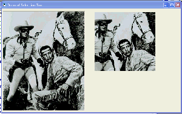

## PictureBox Selection Tool Demo\(updated\)

### Description

This is for the new guys mostly. A simple picturebox selection tool.Also confines cursor to picturebox until selection is completed.
 
### More Info
 

             |
---                |---
**Submitted On**   |2008-05-03 19:48:26
**By**             |[Kenneth Foster](https://github.com/Planet-Source-Code/PSCIndex/blob/master/ByAuthor/kenneth-foster.md)
**Level**          |Intermediate
**User Rating**    |5.0 (15 globes from 3 users)
**Compatibility**  |VB 6\.0
**Category**       |[Graphics](https://github.com/Planet-Source-Code/PSCIndex/blob/master/ByCategory/graphics__1-46.md)
**World**          |[Visual Basic](https://github.com/Planet-Source-Code/PSCIndex/blob/master/ByWorld/visual-basic.md)
**Archive File**   |[PictureBox211160542008\.zip](https://github.com/Planet-Source-Code/kenneth-foster-picturebox-selection-tool-demo-updated__1-70437/archive/master.zip)

